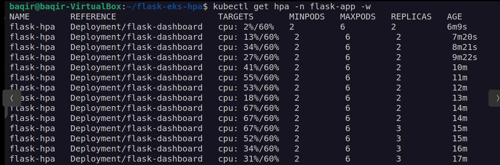
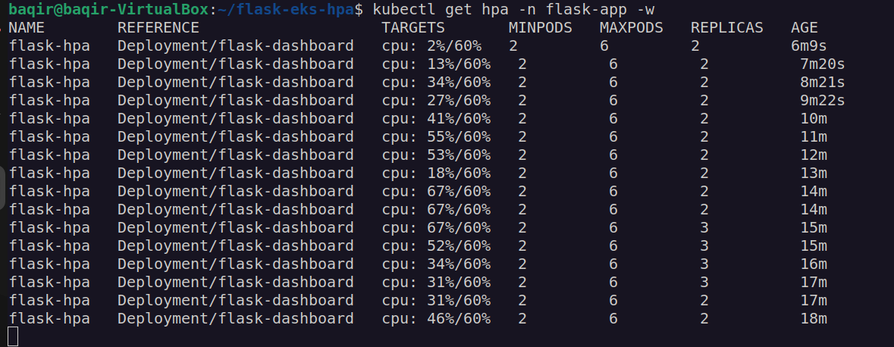
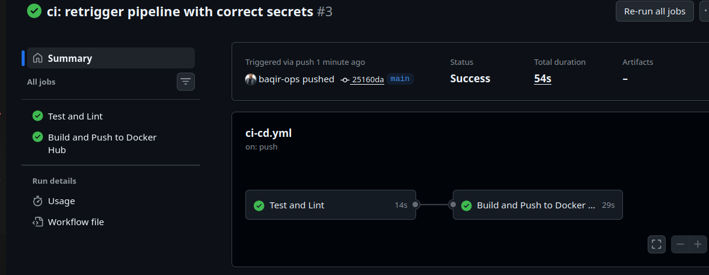
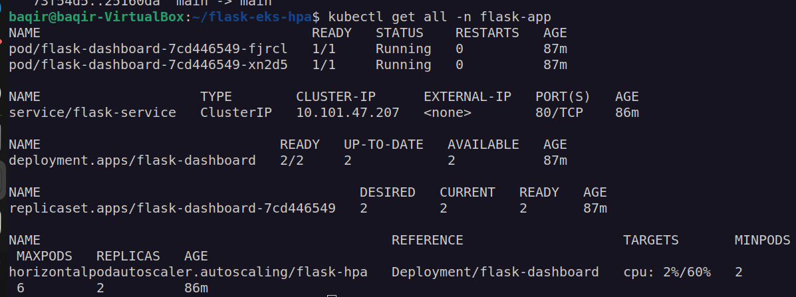
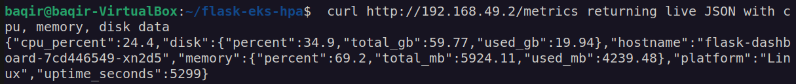
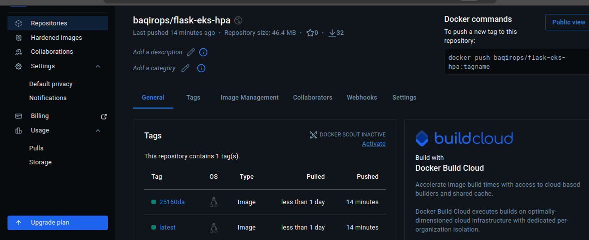

# Flask App on Kubernetes with HPA + NGINX Ingress


> Self-taught Junior DevOps Engineer project. Containerized Flask app deployed on Kubernetes
> with Horizontal Pod Autoscaler, NGINX Ingress, liveness/readiness probes, and a fully
> automated GitHub Actions CI/CD pipeline completing in 54 seconds.

---

## What This Project Demonstrates

| Skill | Implementation |
|---|---|
| Container orchestration | Kubernetes Deployment with rolling updates |
| Auto-scaling | HPA scales 2 to 6 pods at 60% CPU threshold |
| Traffic routing | NGINX Ingress Controller |
| Health monitoring | Liveness and Readiness probes on every pod |
| Container security | Multi-stage build, non-root user, HEALTHCHECK |
| CI/CD automation | GitHub Actions: test, build, push in 54 seconds |
| Image traceability | Dual tags latest and commit SHA on every push |

---

## HPA Auto-Scaling Proven with Live Stress Test



Real output from stress test:

```
cpu: 2%/60%   replicas: 2   <- idle
cpu: 34%/60%  replicas: 2   <- load increasing
cpu: 55%/60%  replicas: 2   <- approaching threshold
cpu: 67%/60%  replicas: 3   <- HPA scaled up automatically
cpu: 31%/60%  replicas: 2   <- load removed, scaled back down
```



---

## CI/CD Pipeline 54 Seconds End to End



Every push to main triggers 2 jobs:

```
push to main
     |
     |-- Job 1: Test and Lint (14s)
     |     - pytest across all endpoints
     |
     `-- Job 2: Build and Push (29s)
           - docker buildx with layer cache
           - push :latest and :sha to Docker Hub
```

---

## Kubernetes Resources



---

## Live API Endpoints



| Endpoint | Description | Probe Type |
|---|---|---|
| GET / | Service info, version, environment | - |
| GET /health | Always returns 200 | Liveness |
| GET /metrics | CPU, memory, disk, uptime, hostname | - |
| GET /ready | Returns 503 if CPU over 95% | Readiness |

---

## Docker Hub



Image: baqirops/flask-eks-hpa

---

## Project Structure

```
flask-eks-hpa/
|- app/
|  |- app.py              # Flask: /, /health, /metrics, /ready
|  |- requirements.txt
|  `- Dockerfile          # Multi-stage, non-root user, HEALTHCHECK
|- k8s/
|  |- namespace.yaml
|  |- deployment.yaml     # 2 replicas, rolling update, probes
|  |- service.yaml        # ClusterIP
|  |- hpa.yaml            # Scale 2-6 pods at 60% CPU
|  `- ingress.yaml        # NGINX routing
|- tests/
|  `- test_app.py         # 5 pytest tests
|- .github/workflows/
|  `- ci-cd.yml           # test, build, push pipeline
`- docs/screenshots/
```

---

## Quick Start

```bash
minikube start --driver=docker --cpus=2 --memory=2200
minikube addons enable ingress
minikube addons enable metrics-server
kubectl apply -f k8s/
curl http://$(minikube ip)/health
curl http://$(minikube ip)/metrics
```

---

## Stress Test the HPA

```bash
# Terminal 1 - watch HPA in real time
kubectl get hpa -n flask-app -w

# Terminal 2 - fire load
kubectl run load-generator --image=busybox --restart=Never -n flask-app \
  -- /bin/sh -c "while true; do wget -q -O- http://flask-service.flask-app; done"

# Stop load
kubectl delete pod load-generator -n flask-app
```

---

## Key Engineering Decisions

- Separate liveness and readiness probes for better traffic control
- Resource requests required on every pod for HPA to calculate utilization
- ClusterIP over LoadBalancer since Ingress handles all external routing
- Dual image tags for convenience and full deployment traceability
- Non-root container user as security best practice

---

## Author

**Muhammad Baqir Nawaz** - Junior DevOps Engineer

[github.com/baqir-ops](https://github.com/baqir-ops) · [linkedin.com/in/baqir-nawaz-devops](https://linkedin.com/in/baqir-nawaz-devops) · [hub.docker.com/u/baqirops](https://hub.docker.com/u/baqirops)
